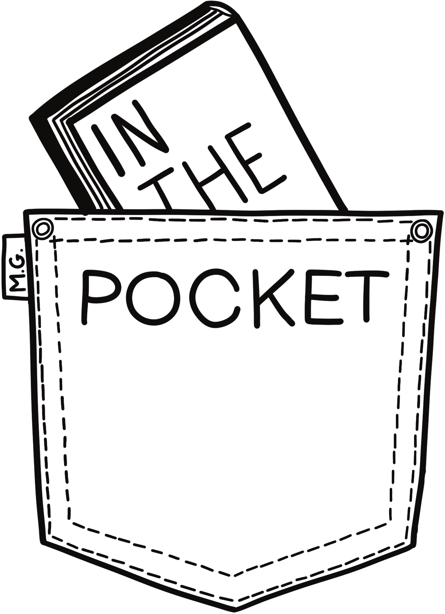

<!-- PROJECT SHIELDS -->
[![LinkedIn][linkedin-shield]][linkedin-url]

<!-- PROJECT LOGO -->
 

  

  <h3 align="center">In The Pocket</h3>

  

    Your library at your fingertips !
  

<!-- TABLE OF CONTENTS -->

  
Table of Contents

  <ol>
    <li>
      <a href="#about-the-project">About The Project</a>
      <ul>
        <li><a href="#built-with">Built With</a></li>
      </ul>
    </li>
    <li><a href="#contact">Contact</a></li>
    <li>
        <a href="#useful-sources">Useful Sources</a>
        <ul>
            <li><a href="#front">Front</a></li>
            <li><a href="#back">Back</a></li>
        </ul>
    </li>
  </ol>

<!-- ABOUT THE PROJECT -->
## About The Project

In a world where the diversity of available books is increasing, it's becoming crucial for readers to be able to manage and organize their collections efficiently. This is where 'In The Pocket' comes in. As someone who is passionate about books, I faced the challenge of effectively managing and organizing my own book collection. Existing apps didn't meet my specific needs, failing to provide satisfactory book management. That's why I decided to create this web application. It also aligns with my goal of achieving my professional title as an Application Designer and Developer.

(<a href="#readme-top">back to top</a>)

### Built With

This section contains a non-exhaustive list of frameworks/libraries that I used for this project.

* [![React][React.js]][React-url]
* [![Laravel][Laravel.com]][Laravel-url]
* [![Tailwind CSS][Tailwind.com]][Tailwind-url]
* [![ReduxToolKit][Redux-shield]][ReduxToolKit-url]
* [![ReactRouter][ReactRouter-shield]][ReactRouter-url]
* [![MySQL][MySQL-shield]][MySQL-url]

(<a href="#readme-top">back to top</a>)

<!-- CONTACT -->
## Contact

Mathéo Guerrazzi - materrazzi.pro@gmail.com

Project Link: [https://github.com/HermesRhoDev/library-front](https://github.com/HermesRhoDev/library-front)

(<a href="#readme-top">back to top</a>)

<!-- USEFUL SOURCES -->
## Useful Sources

In this space you can find resources that helped me during the development of the project.

### Front:
* [Heroicons](https://heroicons.com)
* [React Router](https://reactrouter.com/en/main)
* [Redux Toolkit](https://redux-toolkit.js.org)
* [Google Books APIs](https://developers.google.com/books?hl=fr)
* [Formik](https://formik.org)
* [Tailwind CSS](https://tailwindcss.com)
* [Axios](https://axios-http.com/fr/docs/intro)
* [Vite](https://vitejs.dev)
* [React-Toastify](https://www.npmjs.com/package/react-toastify)
* [Redux Persist](https://www.npmjs.com/package/redux-persist)
* [Match-Sorter](https://www.npmjs.com/package/match-sorter)

### Back:
* [Laravel](https://laravel.com)
* [Laravel Lang](https://laravel-lang.com)
* [Laravel Telescope](https://laravel.com/docs/10.x/telescope)
* [Laravel Breeze](https://laravel.com/docs/10.x/starter-kits#laravel-breeze)
* [Laravel Sail](https://laravel.com/docs/10.x/sail)
* [FakerPHP](https://fakerphp.github.io)
* [PestPHP](https://pestphp.com)

(<a href="#readme-top">back to top</a>)

<!-- MARKDOWN LINKS & IMAGES -->
[linkedin-shield]: https://img.shields.io/badge/-LinkedIn-black.svg?style=for-the-badge&logo=linkedin&colorB=555
[linkedin-url]: www.linkedin.com/in/mathéo-guerrazzi
[product-screenshot]: images/screenshot.png
[React.js]: https://img.shields.io/badge/React-20232A?style=for-the-badge&logo=react&logoColor=61DAFB
[React-url]: https://reactjs.org/
[Laravel.com]: https://img.shields.io/badge/Laravel-FF2D20?style=for-the-badge&logo=laravel&logoColor=white
[Laravel-url]: https://laravel.com
[Tailwind.com]: https://img.shields.io/badge/Tailwind_CSS-38B2AC?style=for-the-badge&logo=tailwind-css&logoColor=white
[Tailwind-url]: https://tailwindcss.com
[Redux-shield]: https://img.shields.io/badge/Redux_Toolkit-593D88?style=for-the-badge&logo=redux&logoColor=white
[ReduxToolKit-url]: https://www.npmjs.com/package/@reduxjs/toolkit
[ReactRouter-shield]: https://img.shields.io/badge/React_Router-CA4245?style=for-the-badge&logo=react-router&logoColor=white
[ReactRouter-url]: https://reactrouter.com/en/main
[MySQL-shield]: https://img.shields.io/badge/MySQL-00000F?style=for-the-badge&logo=mysql&logoColor=white
[MySQL-url]: https://www.mysql.com/fr/